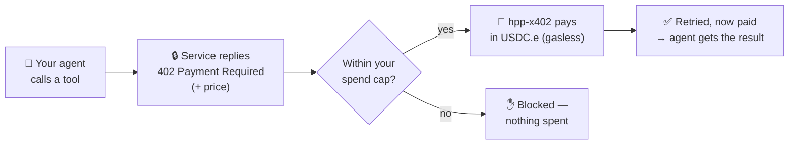
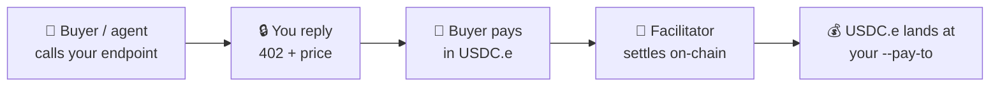

# hpp-x402

Let your AI agent **discover and pay for [x402](https://x402.org) services on HPP** —
per call, within a spend cap, gasless, no API keys, no manual signing.

`hpp-x402` is a command-line tool plus an MCP bridge for Claude Desktop, Claude
Code, Cursor, Windsurf, and OpenClaw. Your agent finds a paid service, pays it in
USDC.e, and gets the result — you just fund a wallet and set a cap.

- [How it works](#how-it-works)
- [Requirements](#requirements)
- [Install](#install)
- [Quick start](#quick-start)
- [Try it from your agent](#try-it-from-your-agent)
- [How your agent reaches services](#how-your-agent-reaches-services) — discovery vs. a specific server
- [Funding & your wallet](#funding--your-wallet)
- [Sell a service](#sell-a-service) — get paid per call
- [Troubleshooting](#troubleshooting)
- [Advanced](#advanced) — Safe mode · spend policy · channels · headless
- [Reference](#reference) — commands · environment variables · networks

## How it works

x402 is a standard where a paid API answers an unpaid request with
`HTTP 402 Payment Required` and the price. `hpp-x402` handles that for your agent:



Three things stay true the whole time:

- **Pay-per-call** — you're charged the exact price of each request, nothing standing.
- **Capped** — the agent can never spend more than you've funded (light mode) or
  more than your on-chain daily allowance (Safe mode).
- **Gasless & keyless** — settlement needs no native gas, and you never paste a
  private key into a prompt. Payments settle in **USDC.e** on HPP.

## Requirements

| | Requirement |
|---|---|
| **Node.js** | 20 or newer — check with `node -v`. Get it from [nodejs.org](https://nodejs.org), `brew install node`, or [nvm](https://github.com/nvm-sh/nvm). |
| **npm** | Bundled with Node.js. |
| **OS** | macOS, Linux, or Windows. |
| **Wallet storage** | An OS keychain (macOS Keychain / Linux gnome-keyring / Windows Credential Manager). No desktop keychain? See [Headless](#headless--server--ci). |

> The installer checks for Node and runs `npm i -g` — it does **not** install Node
> for you. Install Node first, then run the one-liner below.

## Install

```bash
# macOS / Linux
curl -fsSL https://raw.githubusercontent.com/hpp-io/x402-tools/main/install/install.sh | bash
# Windows (PowerShell)
irm https://raw.githubusercontent.com/hpp-io/x402-tools/main/install/install.ps1 | iex
```

Or with npm directly (same result):

```bash
npm install -g @hpp-io/x402-mcp-bridge
```

This puts two binaries on your PATH: `hpp-x402` (the CLI) and `x402-mcp-bridge`
(the server your agent host runs). The install scripts do nothing but the Node
check and `npm i -g` — [read them](./install/) before running.

## Quick start

Three commands. Nothing advanced.

```bash
# 1. Create a wallet and register the bridge into your agent host
hpp-x402 setup --install claude-code     # or: claude | cursor | windsurf | openclaw

# 2. Fund it — the command prints an address; send USDC.e there (no gas needed)
hpp-x402 fund

# 3. Confirm wallet balance + that everything is wired
hpp-x402 status
```

`setup` creates a wallet in your OS keychain and writes the correct MCP config
for your host. You're now in **light mode**: the amount you fund *is* your spend
cap, so start small. Then **restart your agent host** so it picks up the bridge.

## Try it from your agent

After restarting your host, ask your agent:

> **"What's my hpp-x402 wallet address and balance?"**

It should answer using the wallet tools — proof the bridge is connected. Then:

> **"Discover x402 services on HPP and call one."**

The agent uses `hpp_discover` to browse the directory and `hpp_call` to pay and
invoke a service. You'll see the tool run and the paid result come back. That's
the whole point: your agent transacting on its own, inside your cap.

Prefer the terminal? The same thing without an agent:

```bash
hpp-x402 discover --limit 5                        # browse live services (shows each URL + id)
hpp-x402 call <url-or-id> --body '{"hi":"there"}'  # pay + call one — a URL, or an id from discover
```

## How your agent reaches services

There are two ways your agent finds something to pay for. They work together, and
**discovery is on by default** — most people never change this.

| Mode | Use it when | How to enable | What your agent gets |
|------|-------------|---------------|----------------------|
| **Discovery** (default) | You want to find & pay for anything published on HPP | On by default (`HPP_X402_DISCOVERY=on`) | `hpp_discover` + `hpp_call` against the public directory (`x402-discovery.hpp.io`) |
| **Proxy** | You have **one specific** paid MCP server to use | `RESOURCE_SERVER_URL=<url>` | that server's tools, directly, paid on demand |
| **Both** | A known server *plus* open discovery | Set `RESOURCE_SERVER_URL` and leave discovery on | the union of both |

- Leaving `RESOURCE_SERVER_URL` **unset** is the common case — your agent still
  gets discovery plus `x402_http_call` (pay any x402 URL). No server to run.
- Set `RESOURCE_SERVER_URL` only when you're proxying a particular paid MCP
  server (e.g. your own). It's the upstream the bridge connects out to.
- Turn discovery off with `HPP_X402_DISCOVERY=off` if you want *only* your
  proxied server and nothing from the public directory.

These are environment variables on the bridge. `hpp-x402 install <host>` writes
them into your host's MCP config; you can also edit that config directly (see
[Use it from your MCP host](#use-it-from-your-mcp-host)).

## Funding & your wallet

- **Your address:** `hpp-x402 fund` (or `hpp-x402 wallet address`).
- **Send USDC.e** to it on the right network — **HPP Sepolia** (`eip155:181228`,
  the default) or **HPP Mainnet** (`eip155:190415`). No native gas needed.
- **Check balance:** `hpp-x402 wallet balance`. A balance of 0 after funding almost
  always means you funded the **wrong network** — see [Troubleshooting](#troubleshooting).
- **Your cap is what you fund.** In light mode the wallet holds exactly what you
  put in, so it can't overspend. Want a governed cap over a shared treasury
  instead? See [Safe mode](#safe-mode-governance).

## Sell a service

The other side of the rail: turn any endpoint into a **paid x402 service** and get
paid per call in USDC.e. It's the mirror image of the buyer flow.



**The quick way — `hpp-x402 serve`.** One command wraps an endpoint: it returns
`402` until paid, then runs your handler — **echo** by default (handy for testing),
or forward the request body to your own webhook with `--handler <url>`.

```bash
hpp-x402 serve --pay-to 0xYourAddress --price 10000    # 0.01 USDC.e per call
# forward to your API instead of echoing:
hpp-x402 serve --pay-to 0xYourAddress --price 10000 --handler https://api.example.com/run
```

Price is in **atomic USDC.e** (6 decimals): `10000` = 0.01. Payments land at
`--pay-to`. Key options:

| Option | Default | Purpose |
|--------|---------|---------|
| `--pay-to <addr>` | *(required)* | Where USDC.e is received |
| `--price <atomic>` | `10000` (0.01) | Price per call, atomic units |
| `--path <path>` | `/paid/echo` | The paid route |
| `--handler <url>` | echo | Forward the body to your API instead of echoing |
| `--port <n>` | `4030` | Listen port |
| `--private` | *(off)* | Don't advertise to the directory (stay unlisted) |
| `--url <public-url>` | *(request Host)* | Public address to advertise + index (see below) |
| `--network <id>` · `--asset <addr>` | Sepolia · USDC.e | Chain + token |

**Getting discovered.** `serve` advertises discovery metadata by default, so **after
your first paid sale settles** the facilitator indexes your service into the public
directory (`x402-discovery.hpp.io`) — buyers then find it via `hpp-x402 discover`
(or the `hpp_discover` tool). Indexing follows the on-chain settlement, so it's not
instant. Pass `--private` to stay unlisted.

**The indexed URL is the address buyers reach you at.** The 402's resource URL is
derived from the request Host, so a sale that comes in over `localhost` gets listed
as `localhost` — unreachable for anyone else. For a real public service, put `serve`
behind a tunnel or reverse proxy and pass `--url` with that public address, so the
public URL is what's advertised and indexed.

**The full seller → buyer loop (pure CLI):**

```bash
# seller (add --url https://myservice.example.com when public, behind a tunnel)
hpp-x402 serve --pay-to 0xYou --price 1000 --port 4055

# buyer — the first sale is by URL (it's not indexed yet); that sale triggers indexing
hpp-x402 call http://localhost:4055/paid/echo --body '{"hi":"there"}'

# once indexed, anyone can pay it by id
hpp-x402 discover -t http                        # lists it, with its URL and id
hpp-x402 call <id> --body '{"hi":"there"}'
```

**Selling from an agent.** Set `HPP_X402_SELLER=on` and the bridge registers
`seller_*` tools — `seller_create_requirements`, `seller_generate_402`,
`seller_decode_payment`, `seller_verify`, `seller_settle` — so your agent can charge
others over x402 programmatically: build the 402, then verify and settle payments
through the facilitator.

## Troubleshooting

| Symptom | Likely cause & fix |
|---------|--------------------|
| **Agent doesn't see the x402 tools** | Host wasn't restarted, or the config didn't land. Restart the host; re-run `hpp-x402 install <host>`; check the path it printed. |
| **`Couldn't access platform storage` / keychain error** | No OS keychain (headless/server). Use `hpp-x402 setup --print-key` or set `DELEGATE_PRIVATE_KEY` — see [Headless](#headless--server--ci). |
| **Funded, but balance shows 0** | Wrong network. Sepolia is `eip155:181228`, Mainnet is `eip155:190415`. Confirm with `hpp-x402 status` and fund the one you're using. |
| **`install claude-code` says "claude not found"** | Claude Code CLI isn't installed. Install it, then run the `claude mcp add …` line the command prints — or target a file-based host (`claude`, `cursor`, `windsurf`, `openclaw`). |
| **Payment failed / blocked** | Over your per-host cap, or the host isn't allowed. Review with `hpp-x402 policy show`; adjust with `hpp-x402 policy set`. |
| **Which network am I on?** | `hpp-x402 status` prints the network, wallet, and reachability. |

## Advanced

### Safe mode (governance)

Light mode funds the delegate wallet directly. **Safe mode** keeps funds in a
[Safe](https://safe.global) and grants the delegate an **on-chain daily
allowance** via an AllowanceModule — a hard, revocable cap for treasuries and
teams. Set it up with `hpp-x402 safe setup --owner-pk 0x…`; wire it to the bridge
with `SAFE_ADDRESS` + `ALLOWANCE_MODULE_ADDRESS` (both, or neither).

### Spend policy

`hpp-x402 policy` sets per-host guardrails (`~/.hpp-x402/policy.json`) — max per
call, cooldowns, required headers, and whether unlisted hosts are allowed at all.

```bash
hpp-x402 policy set api.example.com --max-per-call 5 --cooldown-ms 300000
```

### Batch-settlement channels

For high-frequency, low-value calls, `hpp-x402 channel` manages batch-settlement
channels (`ls` / `status` / `refund` / `withdraw`).

### Headless / server / CI

A headless box has no OS keychain, so `setup`/`wallet` can't store a key. Either:

```bash
hpp-x402 setup --print-key            # prints a raw key instead of the keychain
# or: export DELEGATE_PRIVATE_KEY=0x...   and skip key generation
```

Read-only commands (`discover`, `status`, `--help`) work anywhere. To try the CLI
without touching the host, run it in Docker:

```bash
docker run --rm node:20 bash -c \
  'npm i -g @hpp-io/x402-mcp-bridge && hpp-x402 discover --limit 5 && hpp-x402 setup --print-key'
```

### Use it from your MCP host

`hpp-x402 install <host>` writes this for you, but here's the shape — the host
spawns the bridge over stdio, configured with env vars:

```json
{
  "mcpServers": {
    "hpp-x402": {
      "command": "npx",
      "args": ["-y", "@hpp-io/x402-mcp-bridge"],
      "env": { "HPP_NETWORK": "eip155:181228" }
    }
  }
}
```

## Reference

### Commands

Run `hpp-x402 <command> --help` for the authoritative, up-to-date flags.

| Command | What it does |
|---------|--------------|
| `setup` | Onboard: create a wallet, print funding info, optionally `--install` a host |
| `wallet <address\|balance\|generate\|import\|remove>` | Manage the keychain wallet |
| `install <host>` | Register the bridge into `claude` / `claude-code` / `cursor` / `windsurf` / `openclaw` |
| `fund` | Show where to send USDC.e |
| `status` | Config · wallet balance · reachability |
| `discover [query]` | Browse/search the HPP service directory (shows each URL + id) |
| `call <url-or-id>` | Pay + call a service — a URL directly, or a resourceId from discover |
| `serve` | Run a paid x402 endpoint (become a seller) |
| `policy` | Per-host spend guardrails |
| `channel` | Batch-settlement channels |
| `safe` | Safe / governance wallet setup |

Common options: `-a, --account <name>` (which keychain wallet; default
`delegate-default`) and `-n, --network <id>` (default `eip155:181228`).

### Environment variables

Set these on the bridge (via `install <host>`, or in the host's MCP config `env`).

| Variable | Default | Purpose |
|----------|---------|---------|
| `DELEGATE_PRIVATE_KEY` | auto-created | Wallet key or `keychain://…` URI |
| `HPP_NETWORK` | `eip155:181228` | CAIP-2 network (Sepolia / Mainnet) |
| `RESOURCE_SERVER_URL` | *(unset)* | Proxy one specific paid MCP server |
| `HPP_X402_DISCOVERY` | `on` | `hpp_discover` / `hpp_call` tools |
| `HPP_X402_DISCOVERY_URL` | `x402-discovery.hpp.io` | Discovery directory base URL |
| `HPP_X402_SELLER` | `off` | Register `seller_*` tools |
| `HPP_X402_FACILITATOR_URL` | `facilitator-sepolia.hpp.io` | Facilitator for verify/settle |
| `SAFE_ADDRESS` + `ALLOWANCE_MODULE_ADDRESS` | *(unset)* | Enable Safe mode (both or neither) |
| `LOG_LEVEL` | `info` | `off` / `info` / `debug` |

### Networks

| Network | CAIP-2 id | Asset |
|---------|-----------|-------|
| HPP Sepolia (default) | `eip155:181228` | USDC.e |
| HPP Mainnet | `eip155:190415` | USDC.e |

## Contents

- [`install/`](./install/) — one-line installers (`install.sh`, `install.ps1`).
- _(more to come: host config examples, JSON schemas, one-click bundles.)_

## License

Apache-2.0
